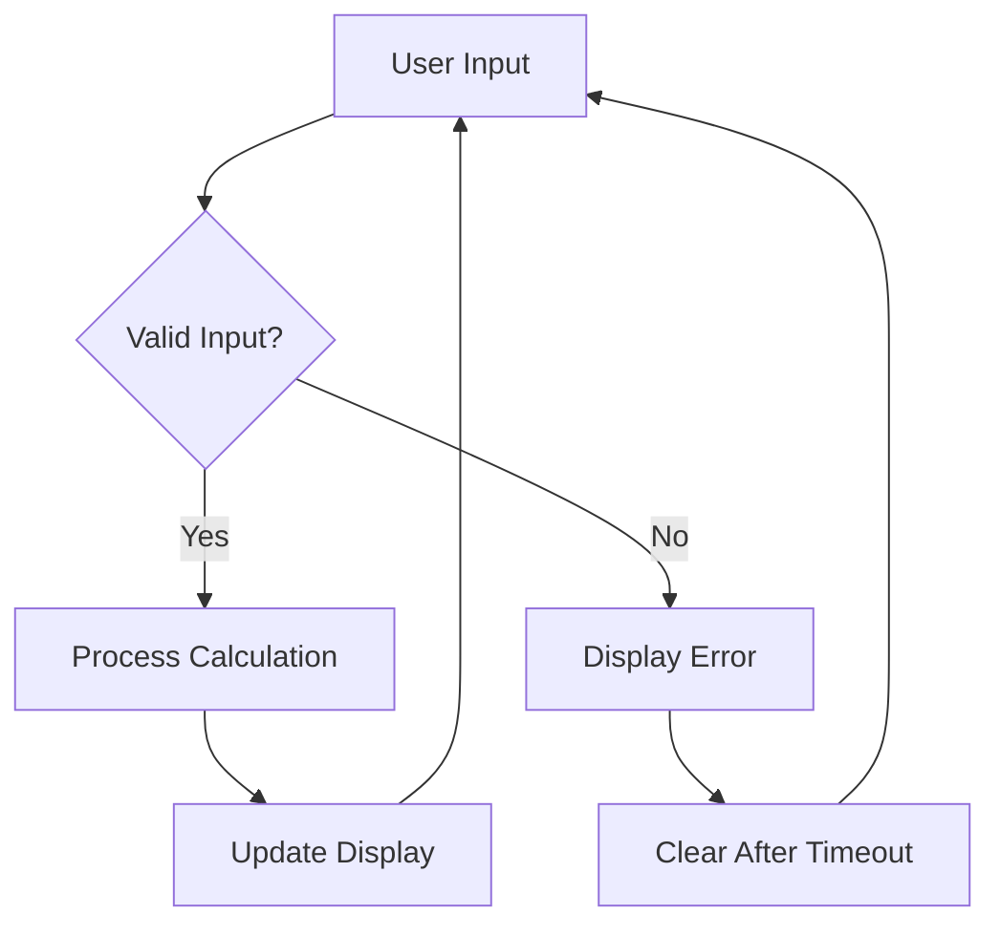

# 🌐 JavaScript Events Exercises

This repository contains a series of exercises focused on JavaScript and web development. Each exercise is designed to help you understand different aspects of web technologies, from basic JavaScript functionalities to more advanced concepts like event handling and DOM manipulation.

## 📋 Exercises Overview

### Exercise 1: Permutation 🔄

**Objective:** Create a form with two text fields and a button. When the button is clicked, the contents of the two text fields should be swapped.

**Code Explanation:**
- The HTML structure includes two text input fields and a button.
- JavaScript is used to handle the button click event. When the button is clicked, the values of the two text fields are swapped using a temporary variable.

```html
<!DOCTYPE html>
<html lang="fr">
<head>
    <meta charset="UTF-8">
    <meta name="viewport" content="width=device-width, initial-scale=1.0">
    <title>Exercice 1 - Permutation</title>
    <style>
        /* CSS */
    </style>
</head>
<body>
    <h1>Permutation de deux zones de texte</h1>
    <div class="form-group">
        <label for="texte1">Zone de texte 1:</label>
        <input type="text" id="texte1" placeholder="Entrez du texte ici">
    </div>
    <div class="form-group">
        <label for="texte2">Zone de texte 2:</label>
        <input type="text" id="texte2" placeholder="Entrez du texte ici">
    </div>
    <button id="permuter">Permuter les textes</button>
    <script>
        const boutonPermuter = document.getElementById('permuter');
        const texte1 = document.getElementById('texte1');
        const texte2 = document.getElementById('texte2');
        
        boutonPermuter.addEventListener('click', function() {
            const temp = texte1.value;
            texte1.value = texte2.value;
            texte2.value = temp;
        });
    </script>
</body>
</html>
```

**✨ Visual Demonstration:**

*Before Permutation:*


*After Permutation:*


---

### Exercise 2: Simple Calculator 🧮

**Objective:** Create a simple calculator that can perform basic arithmetic operations: addition, subtraction, multiplication, and division.

**Code Explanation:**
- The HTML structure includes two input fields for numbers, a set of operation buttons, and a result field.
- JavaScript handles the button click events and performs the corresponding arithmetic operation on the input values.

```html
<!DOCTYPE html>
<html lang="fr">
<head>
    <meta charset="UTF-8">
    <meta name="viewport" content="width=device-width, initial-scale=1.0">
    <title>Exercice 2 - Calculatrice Simple</title>
    <style>
        /* CSS */
    </style>
</head>
<body>
    <h1>Calculatrice Simple</h1>
    <div class="calculatrice">
        <div class="form-group">
            <label for="nombre1">Nombre 1:</label>
            <input type="number" id="nombre1">
        </div>
        <div class="form-group">
            <label for="nombre2">Nombre 2:</label>
            <input type="number" id="nombre2">
        </div>
        <div class="buttons">
            <button id="addition">+</button>
            <button id="soustraction">-</button>
            <button id="multiplication">×</button>
            <button id="division">÷</button>
        </div>
        <div class="form-group">
            <label for="resultat">Résultat:</label>
            <input type="number" id="resultat" readonly>
        </div>
    </div>
    <script>
        const nombre1 = document.getElementById('nombre1');
        const nombre2 = document.getElementById('nombre2');
        const resultat = document.getElementById('resultat');

        const btnAddition = document.getElementById('addition');
        const btnSoustraction = document.getElementById('soustraction');
        const btnMultiplication = document.getElementById('multiplication');
        const btnDivision = document.getElementById('division');
        
        function getValues() {
            const val1 = parseFloat(nombre1.value);
            const val2 = parseFloat(nombre2.value);
            
            if (isNaN(val1) || isNaN(val2)) {
                alert("Veuillez entrer des nombres valides");
                return null;
            }
            
            return { val1, val2 };
        }
 
        btnAddition.addEventListener('click', function() {
            const values = getValues();
            if (values) {
                resultat.value = values.val1 + values.val2;
            }
        });
        
        btnSoustraction.addEventListener('click', function() {
            const values = getValues();
            if (values) {
                resultat.value = values.val1 - values.val2;
            }
        });
        
        btnMultiplication.addEventListener('click', function() {
            const values = getValues();
            if (values) {
                resultat.value = values.val1 * values.val2;
            }
        });
        
        btnDivision.addEventListener('click', function() {
            const values = getValues();
            if (values) {
                if (values.val2 === 0) {
                    alert("Division par zéro impossible");
                    return;
                }
                resultat.value = values.val1 / values.val2;
            }
        });
    </script>
</body>
</html>
```

**✨ Visual Demonstration:**


**Operations Supported:**
| Operation | Symbol | Example |
|-----------|--------|---------|
| Addition | ➕ | 5 + 3 = 8 |
| Subtraction | ➖ | 10 - 4 = 6 |
| Multiplication | ✖️ | 6 × 7 = 42 |
| Division | ➗ | 20 ÷ 5 = 4 |

---

### Exercise 3: BMI Calculator 📏⚖️

**Objective:** Develop a BMI (Body Mass Index) calculator that calculates the BMI based on user input for weight and height.

**Code Explanation:**
- The HTML structure includes input fields for weight and height, a calculate button, and a result display area.
- JavaScript calculates the BMI using the formula `BMI = weight / (height * height)` and provides an interpretation of the BMI value.

```html
<!DOCTYPE html>
<html lang="fr">
<head>
    <meta charset="UTF-8">
    <meta name="viewport" content="width=device-width, initial-scale=1.0">
    <title>Calculateur d'IMC</title>
    <style>
        /* CSS */
    </style>
</head>
<body>
    <div class="calculateur">
        <h1>Calculateur d'IMC</h1>
        <div class="form-group">
            <label for="poids">Poids (kg):</label>
            <input type="number" id="poids" placeholder="76" min="1" max="300" step="0.1">
        </div>
        <div class="form-group">
            <label for="taille">Taille (m):</label>
            <input type="number" id="taille" placeholder="1.45" min="0.5" max="2.5" step="0.01">
        </div>
        <button id="calculer">Calculer mon IMC</button>
        <div id="resultat"></div>
    </div>
    <script>
        document.getElementById('calculer').addEventListener('click', function() {
            const poids = parseFloat(document.getElementById('poids').value);
            const taille = parseFloat(document.getElementById('taille').value);

            if (isNaN(poids) || isNaN(taille) || poids <= 0 || taille <= 0) {
                document.getElementById('resultat').innerHTML = 'Veuillez entrer des valeurs valides.';
                return;
            }
 
            const imc = poids / (taille * taille);

            let interpretation = '';
            if (imc < 18.5) {
                interpretation = 'insuffisance pondérale';
            } else if (imc < 25) {
                interpretation = 'corpulence normale';
            } else if (imc < 30) {
                interpretation = 'surpoids';
            } else if (imc < 35) {
                interpretation = 'obésité modérée';
            } else if (imc < 40) {
                interpretation = 'obésité sévère';
            } else {
                interpretation = 'obésité morbide ou massive';
            }

            document.getElementById('resultat').innerHTML = 
                `Votre IMC est de ${imc.toFixed(2)}. Vous êtes en état d'${interpretation}.`;
        });
    </script>
</body>
</html>
```

**✨ Visual Demonstration:**


**BMI Categories Chart:**

| Category | BMI Range | Indication |
|----------|-----------|------------|
| 🍃 Underweight | < 18.5 | Insuffisance pondérale |
| ✅ Normal | 18.5 - 24.9 | Corpulence normale |
| ⚠️ Overweight | 25.0 - 29.9 | Surpoids |
| 🔴 Obesity Class I | 30.0 - 34.9 | Obésité modérée |
| 🔴🔴 Obesity Class II | 35.0 - 39.9 | Obésité sévère |
| 🔴🔴🔴 Obesity Class III | ≥ 40.0 | Obésité morbide ou massive |

---

### Exercise 4: Advanced Scientific Calculator 🧪🔬

**Objective:** Develop a comprehensive scientific calculator that can perform advanced mathematical operations such as square root, exponentiation, trigonometric functions, and logarithms.


**✨ Key Features:**

| Feature | Icon | Description |
|---------|------|-------------|
| **Trigonometric Functions** | 📐 | Calculate sine, cosine, and tangent values |
| **Logarithmic Functions** | 📊 | Natural logarithm (ln) and base-10 logarithm (log) |
| **Power Operations** | 💪 | Square, power, and square root calculations |
| **Constants** | 🧬 | Mathematical constants like e (Euler's number) |
| **Factorial** | ❗ | Calculate factorial of a number (n!) |
| **Memory Functions** | 🧠 | Store and recall calculation results |
| **Error Handling** | 🛡️ | Graceful handling of invalid operations |

**Code Implementation Highlights:**

```javascript
// Example of the square root function implementation
function sqrt() {
    const value = getCurrentValue();
    if (value < 0) {
        display.value = 'Erreur';
        setTimeout(() => {
            clearDisplay();
        }, 1500);
        return;
    }
    displayValue = Math.sqrt(value).toString();
    display.value = displayValue;
}

// Example of the trigonometric function implementation
function sin() {
    const value = getCurrentValue();
    displayValue = Math.sin(value).toString();
    display.value = displayValue;
}

// Example of error handling for division
function inv() {
    const value = getCurrentValue();
    if (value === 0) {
        display.value = 'Erreur';
        setTimeout(() => {
            clearDisplay();
        }, 1500);
        return;
    }
    displayValue = (1 / value).toString();
    display.value = displayValue;
}
```

**📱 UI Design Features:**
- **Grid Layout** - Modern responsive design using CSS Grid
- **Color-Coded Buttons** - Intuitive visual grouping of related functions
- **Sleek Display** - Clean, easy-to-read results display
- **Hover Effects** - Interactive visual feedback for better user experience

**🔄 Operation Flow:**



**⚙️ Technical Details:**
- **Precision Handling** - Maintains calculation accuracy across operations
- **Expression Evaluation** - Parses and evaluates complex mathematical expressions
- **Input Validation** - Prevents invalid operations and provides helpful error messages
- **Event Handling** - Responds to user interactions with appropriate calculations

---

## 🎓 Learning Outcomes

Working through these exercises will help you master:

1. 🖱️ **Event Handling** - Responding to user interactions
2. 🔄 **DOM Manipulation** - Dynamically updating page content
3. 🧮 **JavaScript Calculations** - Implementing mathematical operations
4. 🎨 **UI/UX Design** - Creating intuitive user interfaces
5. 🐞 **Error Handling** - Gracefully managing edge cases

## 🚀 Next Steps

After completing these exercises, consider enhancing them with:

- 📱 **Responsive Design** - Optimize for mobile devices
- 🌈 **Advanced Styling** - Add animations and transitions
- 💾 **Local Storage** - Save calculation history
- 📊 **Data Visualization** - Add charts for the BMI calculator
- 🔌 **API Integration** - Connect to external calculation services

## 🔍 Conclusion

These exercises provide a comprehensive foundation in JavaScript and web development. The progression from simple operations (text permutation) to complex applications (scientific calculator) offers a practical learning path for mastering frontend web development concepts. Each exercise builds upon skills learned in the previous ones, creating a holistic learning experience.

Happy coding! 💻✨
